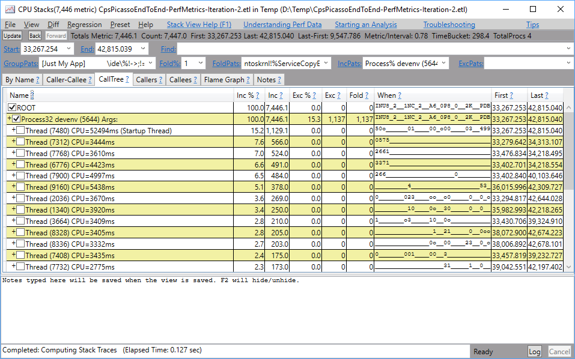
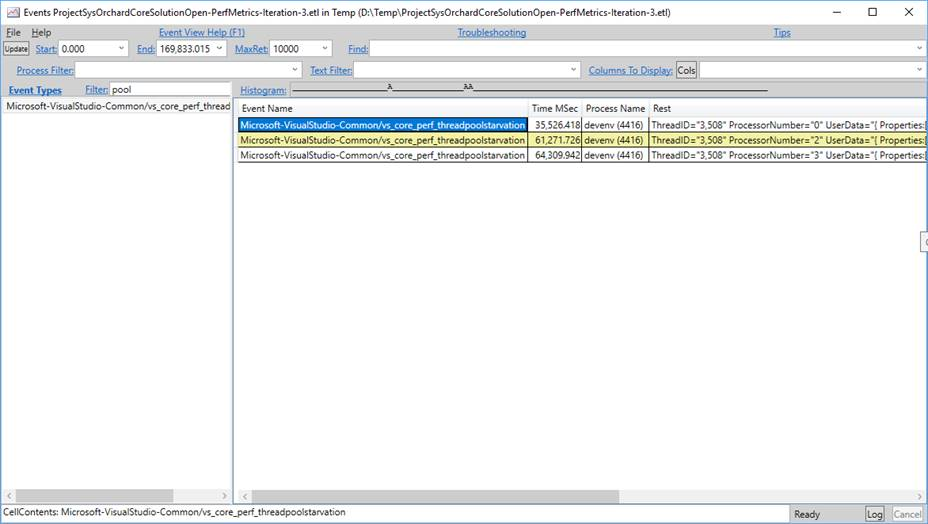
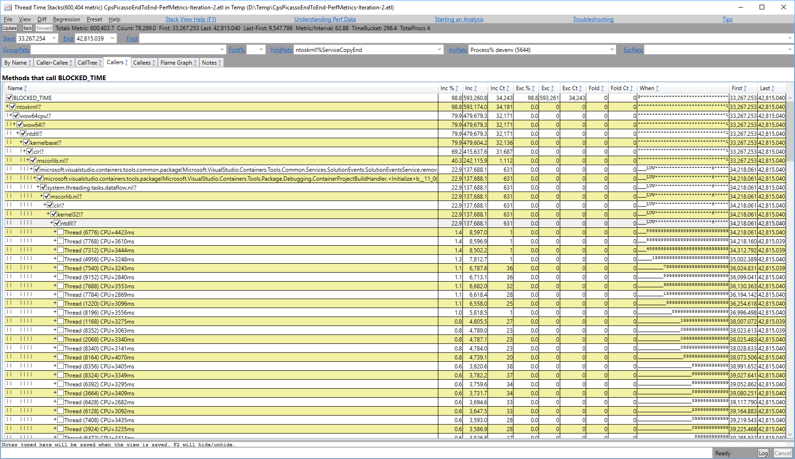

# Investigating thread starvation issues

## Summary

Thread starvation are cases where tasks dispatched to managed thread pool doesn't start executing immediately due to other work in the thread pool. In certain cases, the starvation can cause task execution to delay up to a second and if the main thread is waiting for the task to complete, this will cause elapsed time regressions as well as responsiveness issues in the product.

A thread pool starvation issue usually manifests itself as a long blocked time on main thread waiting for background work.

## Details about CLR thread pool

In general CLR thread pool is designed short running tasks that don't block the threads and CLR will adjust active worker thread counts to maximize throughput. Because of this, long running tasks that block on network IO, other async tasks can cause problems in how CLR allocates threads. In order to avoid these issues, it is recommended to always use async waits even in thread pool threads to avoid blocking a thread with no actual work being done. There are async APIs available already to do file IO, network IO that should make this easier.

CLR maintains two different statistics for managing thread pool threads. First is the reserved threads which are the actual physical threads created/destroyed in the system. Second is the active thread count which is the subset of the first that are actually used for executing jobs.

In summary, not all of the thread pools threads visible in traces are actively used by CLR to schedule jobs instead majority of them are kept in reserved state which makes it very hard to analyze starvation from CPU/thread time samples alone without knowing the active thread count available for work.

For the logic of making more threads available for work, CLR will follow a something similar to:
* For anything up to MinThreads, which is equal to number of cores by default, reserved threads will be created on demand and will be made available on demand.
* After that point, if more work is still queued CLR will slowly adjust available thread count, creating reserved threads as needed or promoting existing reserved threads to available state. As this happens CLR will continue to monitor work throughput rate.
* For cases where available thread count is higher than min count, the CLR algorithm above might also decrease available thread count even if more work is available to see if throughput increases with less parallel work. So the adjustments usually a follow an upward trending zig zag pattern when work is constantly available.
* Once thread pool queue is empty or number of queued items decreases, CLR will quickly retire available threads to reserved status. In traces we see this happening under a second for example if no more work is scheduled.
* Reserved threads will only be destroyed if they are not used for a while (in order of minutes). This is to avoid constant cost of thread creation/destruction.

On a quad core machine, there will be minimum of 4 active threads at any given time. A starvation may occur anytime these 4 active threads are blocked in a long running operation.

## Investigating the root cause of thread starvation

We use [PerfView](https://aka.ms/perfview) for these investigations.

### When to suspect thread pool starvation

First, consider how we might come to suspect that thread pool starvation is to blame for a performance or responsiveness problem in the application. In PerfView if we were looking at a sluggish scenario with the CPU Stacks window, we might observe this:

Notice how the `When` column shows several vertical columns of time where there is little or no CPU activity. This is a good indication that we have either excessive lock contention or thread pool exhaustion.

#### Visual Studio specific tips

Recent versions of Visual Studio raise an ETW event called `Microsoft-VisualStudio-Common/vs_core_perf_threadpoolstarvation` when thread pool starvation is detected. This is a sure clue of the problem and can give you a time range within the trace to focus your investigation.

### Investigation steps

While the CLR has thread pool ETW events to indicate thread starvation, these events are not included in a trace due by default to their cost and volume. You can however use the Thread Time Stacks view in PerfView to analyze what work was going on in the thread pool during the time the main thread was blocked to see if starvation was an issue or not.

1. Open the trace in PerfView and open the Thread Time stacks view filtered to the process you suspect may be experiencing thread pool starvation. You need to open the view from PerfView main window instead of scenarios view. The one opened from scenarios view will not show work that was started before the scenario which might be important in this case.
1. In the Thread Time Stacks window, set the Start and End fields to the time range where you had a responsiveness problem.
1. Make sure symbols for the `clr` module are loaded.
1. In the "By Name" tab, find the `clr!ThreadpoolMgr::ExecuteWorkRequest` frame and invoke the "Include Items" command. This will add the frame to the `IncPats` field and filter all frames and stacks to those found on threadpool threads.
1. Also in the "By Name" tab, find the `BLOCKED_TIME` row and invoke the "Show Callers" command.  This will show all stacks that led to any thread pool thread waiting instead of executing on the CPU. 

Take a look at the stacks where the most threads or the most time is spent blocked. This is the code where you should focus your effort to remove the synchronous block. Common mitigations include:

1. Switch synchronous waits to async awaits for I/O, a switch to the main/UI thread, or a semaphore.
1. Avoid lock contention by throttling down concurrency (perhaps to just one sequential operation at once) or using a lock-free design.

### Useful background

In a thread pool exhaustion case, you will have at least as many thread pool threads as you have CPU cores on the machine the trace was taken from. Once all thread pool threads have blocked at the same time, the CLR will wait one second before adding another thread to the threadpool in an attempt to make more progress. Each second that passes without progress another thread may be added.

The CLR may deactivate these excess thread pool threads *without killing them* such that they do not participate in dequeuing work from the thread pool. In these investigations then, the presence of a thread pool thread that isn't blocked by user code is _not_ a clear indication that starvation is not occurring. In fact it may still be occurring if all thread pool threads that the CLR deems to be "active" are blocked in user code.

## RPS specific notes

* RPS machines are quad core machines.
* ETW events that indicate threadpool starvation are not collected on RPS machines due to their cost and volume.

## Avoiding thread pool starvation

There are multiple major causes of thread pool starvation. Each is briefly described below with mitigation options.

### Blocking a thread pool thread while waiting for the UI thread

When a thread pool thread tries to access an STA COM object such as Visual Studio's IServiceProvider or a service previously obtained from this interface, the call to that COM object will require an RPC (Remote Procedure Call) transition which blocks the thread pool thread until the UI thread has time to respond to the request. Learn more about RPC calls from [this blog post](https://blogs.msdn.microsoft.com/andrewarnottms/2014/05/07/asynchronous-and-multithreaded-programming-within-vs-using-the-joinabletaskfactory/).

The mitigation for this is to have the method that is executing on the thread pool asynchronously switch to the UI thread *before* calling into an STA COM object. This allows the thread pool thread to work on something else on the thread pool's queue while the UI thread is busy or servicing this request. After interacting with the STA COM object, the async method can switch back to the thread pool if desired.

### Flooding the thread pool queue

When a component sends many work items to the thread pool in a short timeframe, the queue will grow to store them till one of the thread pool threads can execute them all. Any subsequently queued items will be added to the end of the queue, regardless of their relative priority in the application. When the queue is long, and a work item is appended to the end of the queue that is required for the UI of the application to feel responsive, the application can hang or feel sluggish due to the work that otherwise should be running in the background without impacting UI responsiveness.

The mitigation is for components that have many work items to send to the threadpool to throttle the rate at which new items are introduced to the threadpool to a reasonably small number. This helps keep the queue short, and thus any newly enqueued work will execute much sooner, keeping the application responsive. Throttling work can be done such that the CPU stays busy and the background work moving along quickly, but without sacrificing UI responsiveness. See [this blog post](https://blogs.msdn.microsoft.com/andrewarnottms/2017/05/11/limiting-concurrency-for-faster-and-more-responsive-apps/) for more information on how to easily throttle concurrent work.

## Learn more

Vance Morrison wrote [a blog post](https://blogs.msdn.microsoft.com/vancem/2018/10/16/diagnosing-net-core-threadpool-starvation-with-perfview-why-my-service-is-not-saturating-all-cores-or-seems-to-stall/) describing this situation as well.
